# DAG — Pré-requisitos visualizados

> Mapa visual de dependências entre módulos. Renderizado nativamente em GitHub via Mermaid.
>
> **Convenções gráficas:**
> - **Caixas com bordas arredondadas** = módulos regulares.
> - **Caixas com bordas duplas** = Capstones (Erkenntnisprojekt v0-v4).
> - **Caixas pontilhadas** = módulos paralelos (sem prereqs estritos).
> - **Setas sólidas** = pré-requisito intra-Stage.
> - **Setas tracejadas** = pré-requisito cross-Stage.
> - **Caixas em cor distinta por Stage** = camada do framework.

Pré-requisitos extraídos de [INDEX.md](INDEX.md). Para detalhe textual, cf. cada módulo + Stage README.

---

## Mapa global cross-Stage (caminho crítico)

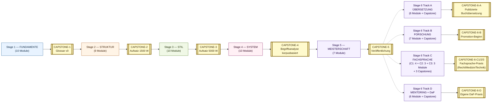

> **Spezialisierungs-Tracks** Stage 6 sind optional + parallel post-CAPSTONE-5. Alle 4 Tracks (A + B + C + D) v2.5 vollständig implementiert.

---

## Stage 1 — FUNDAMENTE

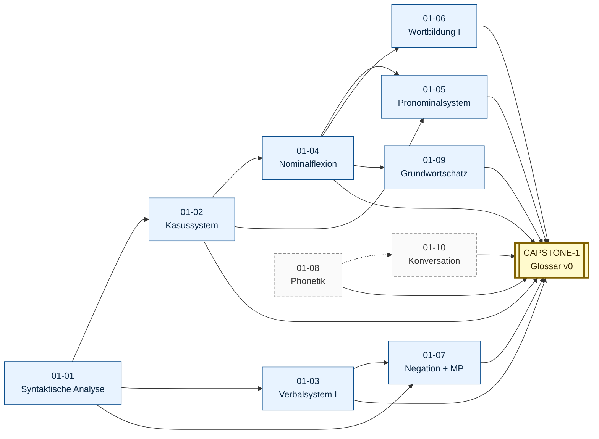

> **Konvention:** 01-10 (Konversation) ist parallel und erfordert Tandem-Praxis (Modus B); 01-08 (Phonetik) ist Voraussetzung lautlich (gepunktet), aber kein hartes Prereq.

---

## Stage 2 — STRUKTUR

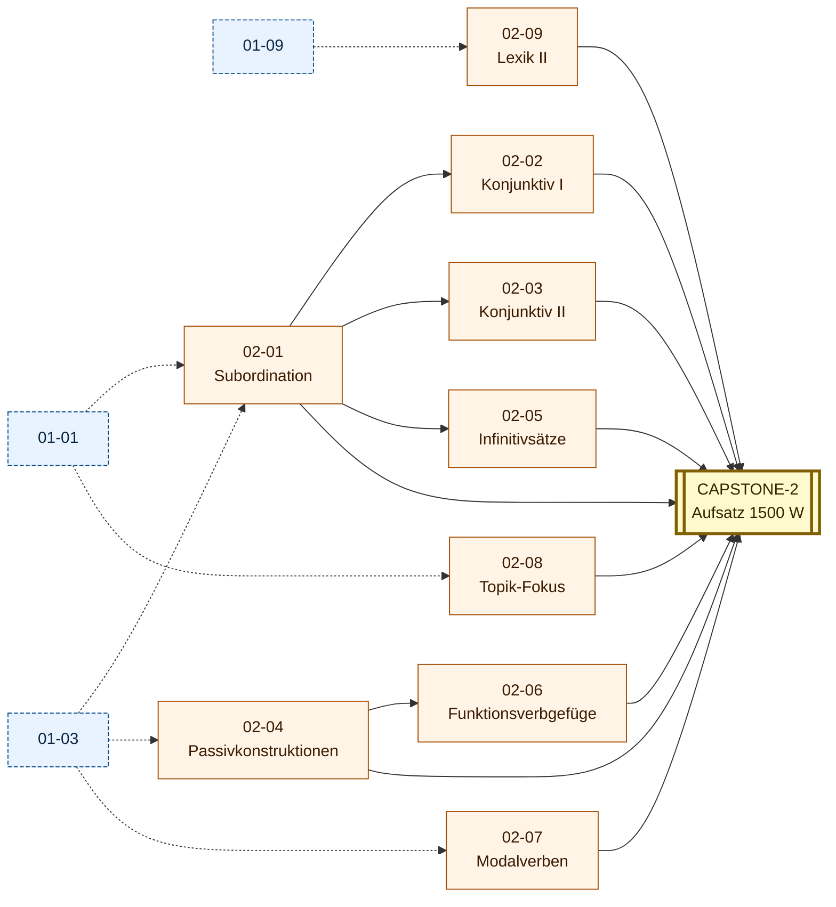

---

## Stage 3 — STIL

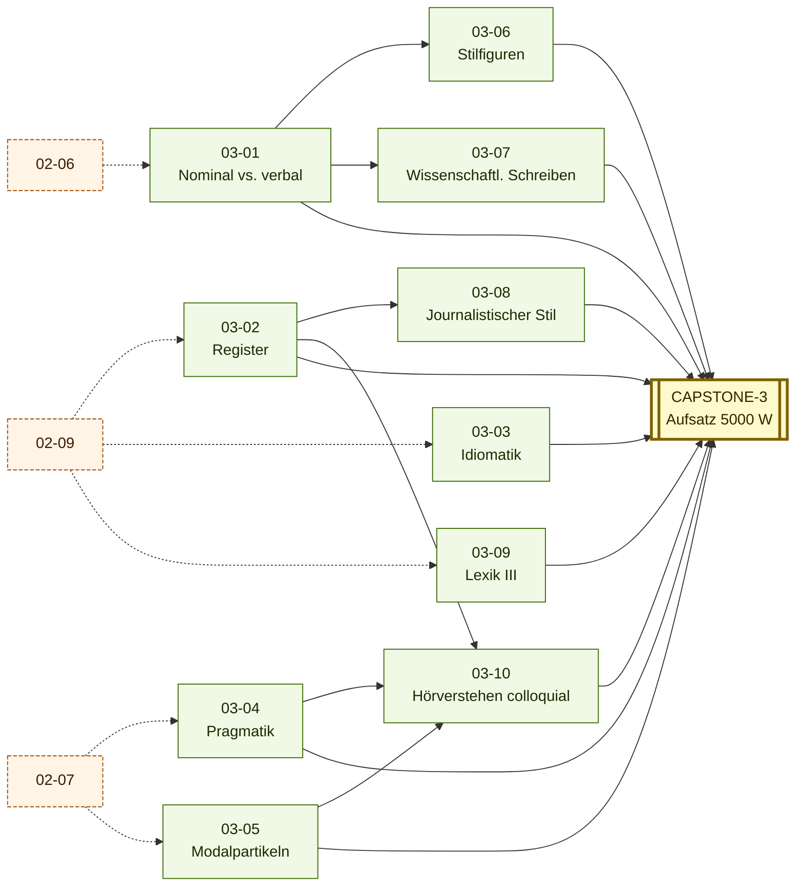

> **Konvention:** 03-10 (Hörverstehen colloquial) konsolidiert Register (03-02), Pragmatik (03-04) und Modalpartikeln (03-05) in der Rezeption; cross-link an 01-08 Phonetik + 01-10 Konversation für Aussprache-Internalisierung.

---

## Stage 4 — SYSTEM

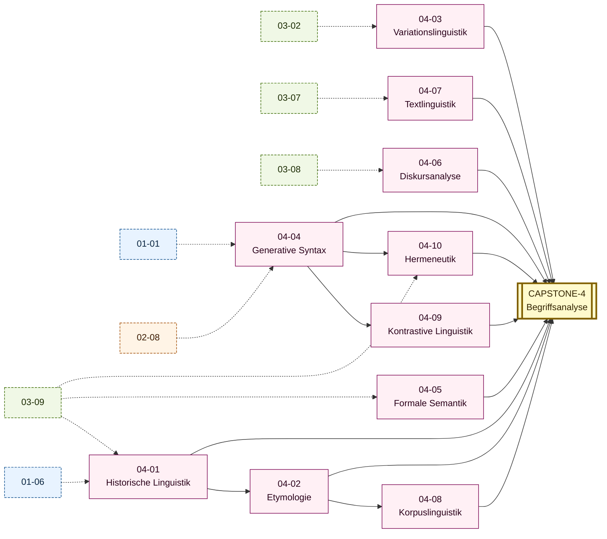

---

## Stage 5 — MEISTERSCHAFT

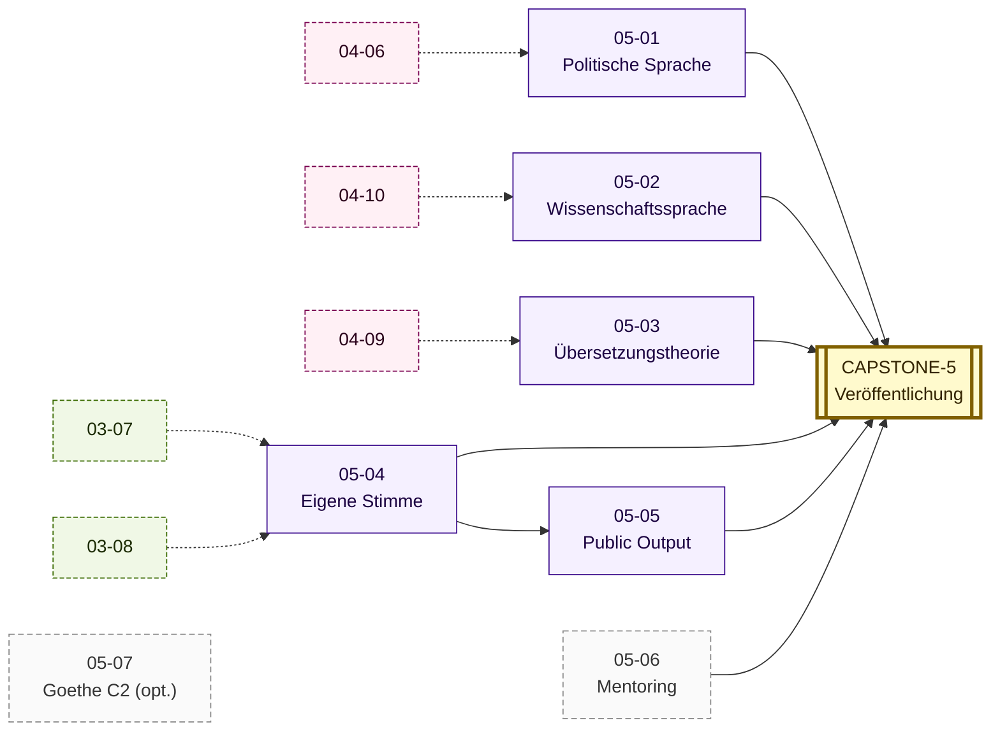

---

## Stage 6 Track A — ÜBERSETZUNGSWISSENSCHAFT + PRAXIS

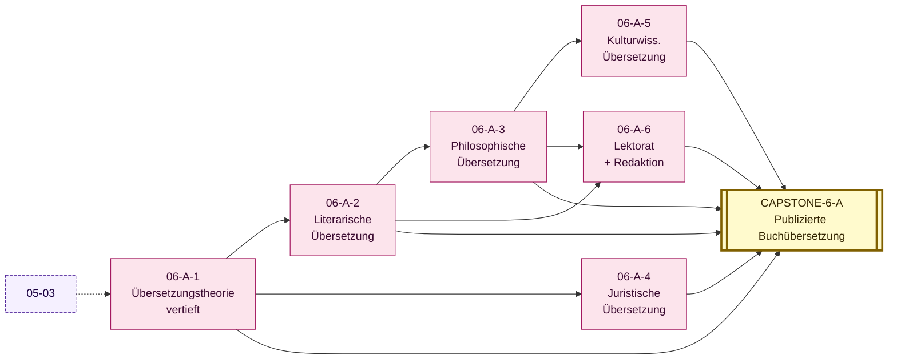

---

## Stage 6 Track B — GERMANISTISCHE FORSCHUNG (Promotion-Vorbereitung)

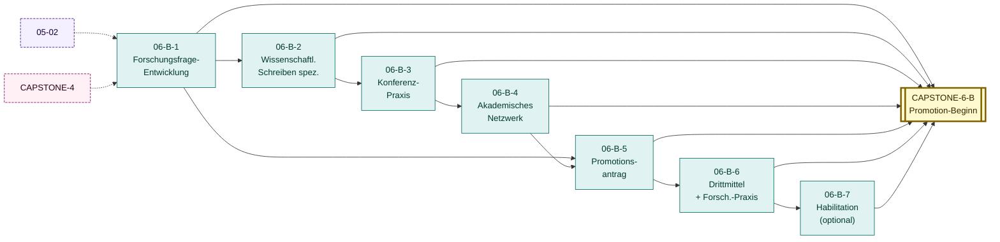

---

## Caminhos críticos cross-Stage

### Caminho A — Sintaxe → Generative → Hermenêutica

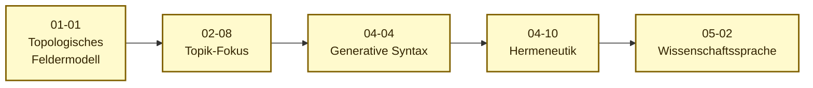

Sem este caminho dominado, leitura de Heidegger / Hegel / Habermas é tateamento.

### Caminho B — Lexik → Register → Diskursanalyse

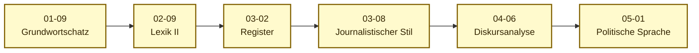

Sem este caminho, análise de Bundestag-Plenarprotokoll é leitura ingênua.

### Caminho C — Schreiben → Stilbildung → Output

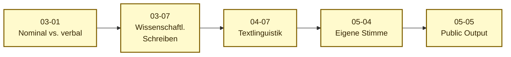

Sem este caminho, CAPSTONE-5 (Veröffentlichung) é tentativa em vez de output.

### Caminho D — Diakronie → Korpus → Begriffsgeschichte

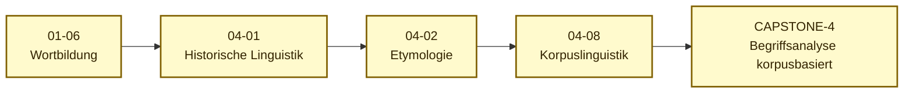

Sem este caminho, CAPSTONE-4 não tem método empírico — vira ensaio impressionista.

### Caminho E — Konversation → Hörverstehen → Public Output (Trilha G Auswandern)

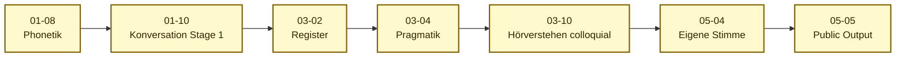

Sem este caminho, fluência conversacional cotidiana fica em **Tagesschau-Standard sem traseira colloquial** — ouvinte profissional entende, mas no Späti em Berlin trava. Caminho crítico para Trilha G (Auswandern, cf. LEARNING-PATHWAYS §7.5).

---

## Como usar este DAG

### Beim Planen

1. **Mapear posição atual**: identificar quais módulos estão DONE em PROGRESS.md.
2. **Identificar nós desbloqueados**: módulos cujos prereqs estão satisfeitos.
3. **Escolher próximo módulo**: priorizar por trilha (cf. LEARNING-PATHWAYS.md) e Begriff (cf. BEGRIFF-INDEX.md).

### Beim Auditieren

1. **Audit de progressão** (cf. MENTOR.md §10.4): cada 90 dias, sobrepor PROGRESS.md ao DAG e diagnosticar:
   - Módulos com prereqs satisfeitos mas não-iniciados há > 60 dias?
   - Módulos iniciados mas com Tor pendente há > 30 dias?
   - Caminho crítico (A-D) progride proporcionalmente?

### Beim Branchen

Trilhas (cf. LEARNING-PATHWAYS.md) podem **omitir** caminhos não-essenciais:

- **Trilha E (Berufsdeutsch)**: omite Caminho D (Diakronie/Korpus) parcialmente.
- **Trilha B (Geisteswissenschaft)**: enfatiza Caminhos A + D.
- **Trilha D (Tradução)**: enfatiza 04-09 + 05-03 (não no DAG core acima).

---

## Cross-references

- [INDEX.md](INDEX.md) — listagem textual completa dos prereqs.
- [LEARNING-PATHWAYS.md](LEARNING-PATHWAYS.md) — 6 trilhas alternativas com seus DAGs próprios.
- [CAPSTONE-EVOLUTION.md](CAPSTONE-EVOLUTION.md) — encadeamento dos Capstones em torno de Begriff.
- Stage READMEs (cada um com DAG local em ASCII + Mermaid):
  - [Stage 1 README](../01-fundamente/README.md)
  - [Stage 2 README](../02-struktur/README.md)
  - [Stage 3 README](../03-stil/README.md)
  - [Stage 4 README](../04-system/README.md)
  - [Stage 5 README](../05-meisterschaft/README.md)
