# FATHOM-Deutsch — INDEX (Deutsche Fassung)

> **Hinweis:** Dies ist die deutschsprachige Parallel-Übersetzung von [INDEX.md](INDEX.md) (PT-BR-Original). Bestimmt für fortgeschrittene Lerner (C1+), die das Framework auf Deutsch konsultieren möchten. Bei Inkonsistenzen gilt das PT-BR-Original als Referenz; diese Übersetzung wird mit jeder Major-Release synchronisiert.
>
> **Status:** Erstübersetzung v1.7 (2026-05-09). Resolve **SN-008 partial start**.

---

## Übersicht

> Globale Karte der 5 Stages. Jede Zeile verweist auf das jeweilige Modul. Voraussetzungen (`prereqs`) bestimmen die Reihenfolge; innerhalb jedes Stages können Module parallel bearbeitet werden, sofern die Prereqs erfüllt sind.
>
> **Komplementäre Meta-Dokumente**: [CAPSTONE-EVOLUTION](CAPSTONE-EVOLUTION.md), [REFERENCES-ELITE](REFERENCES-ELITE.md), [READING-LIST](READING-LIST.md), [GLOSSAR](GLOSSAR.md) (linguistisch), **[BEGRIFFS-GLOSSAR](BEGRIFFS-GLOSSAR.md)** (philosophisch-philologisch, 111 Einträge cross-Stage), [SELF-ASSESSMENT](SELF-ASSESSMENT.md), [RUBRIC](RUBRIC.md), [ANKI-FRAMEWORK](ANKI-FRAMEWORK.md), **[ANKI-STARTER-DECK-STAGE-1](ANKI-STARTER-DECK-STAGE-1.md)** (~500 Karten) + **[ANKI-STARTER-DECK-STAGE-2](ANKI-STARTER-DECK-STAGE-2.md)** (~700 Karten) + **[ANKI-STARTER-DECK-STAGE-3](ANKI-STARTER-DECK-STAGE-3.md)** (~700 Karten), **[SELF-TEST-BANK-STAGE-1](SELF-TEST-BANK-STAGE-1.md)** + **[SELF-TEST-BANK-STAGE-2](SELF-TEST-BANK-STAGE-2.md)** + **[SELF-TEST-BANK-STAGE-3](SELF-TEST-BANK-STAGE-3.md)** (~30 Übungen pro Stage mit Lösungen), [FEHLERPROTOKOLL-TEMPLATE](FEHLERPROTOKOLL-TEMPLATE.md), [MODULE-TEMPLATE](MODULE-TEMPLATE.md), [LEARNING-PATHWAYS](LEARNING-PATHWAYS.md) (7 alternative Trilhas), [BEGRIFF-INDEX](BEGRIFF-INDEX.md) (7 Begriffe scaffolded), [DAG](DAG.md) (Mermaid visuell + kritische Pfade), **[AUDIO-VIDEO-CANON](AUDIO-VIDEO-CANON.md)** (Vorträge-Kanon mit Timestamps für Shadowing), **[STAGE-6-OUTLINE](STAGE-6-OUTLINE.md)** (Spezialisierungs-Tracks Blueprint), [RELEASE-NOTES](RELEASE-NOTES.md), [CHANGELOG](CHANGELOG.md), [DECISION-LOG](DECISION-LOG.md), [SPRINT-NEXT](SPRINT-NEXT.md), [ROADMAP](../../ROADMAP.md).
>
> **Kanonische Anhänge** ([anhaenge/](anhaenge/) — vgl. [README des Verzeichnisses](anhaenge/README.md)): [A — Ablautreihen](anhaenge/ANHANG-A-ABLAUTREIHEN.md) (~166 starke Verben) · [B — Modalverben](anhaenge/ANHANG-B-MODALVERBEN.md) (Modi+Tempora) · [C — Präpositionen](anhaenge/ANHANG-C-PRAEPOSITIONEN.md) · [D — Konnektoren](anhaenge/ANHANG-D-KONNEKTOREN.md) · [E — Adjektivdeklination](anhaenge/ANHANG-E-ADJEKTIVDEKLINATION.md) · [F — PT-DE Kontrastive](anhaenge/ANHANG-F-PT-DE-KONTRASTIVE.md) · [G — FVG kanonisch](anhaenge/ANHANG-G-FVG-CANONICA.md) (>250 FVG) · [H — Stilfiguren-Beispiele](anhaenge/ANHANG-H-STILFIGUREN-BEISPIELE.md) · [I — Wortbildung](anhaenge/ANHANG-I-WORTBILDUNG.md) · [J — Phraseologismen](anhaenge/ANHANG-J-PHRASEOLOGISMEN.md) (~450) · **[K — Alltagskommunikation](anhaenge/ANHANG-K-ALLTAGSKOMMUNIKATION.md)** (Telefon/Service/Small Talk/Behörden/Notfälle) · **[L — Dialekte + Soziolekte](anhaenge/ANHANG-L-DIALEKTE.md)** (Berlinerisch/Bayrisch/Wienerisch/Schwyzerdütsch + Jugendsprache + Kiezdeutsch).
>
> **Output-Templates** ([templates/](templates/) — vgl. [README](templates/README.md)): [Tagebuch](templates/TAGEBUCH-TEMPLATE.md) · [Aufsatz 1500 W](templates/AUFSATZ-1500W-TEMPLATE.md) · [Aufsatz 5000 W](templates/AUFSATZ-5000W-TEMPLATE.md) · [Vortrag](templates/VORTRAG-TEMPLATE.md) · [Begriffsanalyse korpusbasiert](templates/BEGRIFFSANALYSE-TEMPLATE.md) · [Glosse](templates/GLOSSE-TEMPLATE.md) · [Übersetzungsanalyse](templates/UEBERSETZUNGSANALYSE-TEMPLATE.md) · [Veröffentlichung-Submission](templates/VEROEFFENTLICHUNG-TEMPLATE.md).
>
> **Worked examples** ([examples/](examples/) — vgl. [README](examples/README.md)): [CAPSTONE-1 — Aufklärung](examples/CAPSTONE-1-AUFKLAERUNG-EXEMPLAR.md) (Glossar v0, 30 Einträge) · [CAPSTONE-2 — Aufklärung](examples/CAPSTONE-2-AUFKLAERUNG-EXEMPLAR.md) (Aufsatz argumentativ ~1500W) · [CAPSTONE-3 — Aufklärung](examples/CAPSTONE-3-AUFKLAERUNG-EXEMPLAR.md) (Aufsatz wissenschaftlich ~5000W).

---

## Stage 1 — FUNDAMENTE (Grundstrukturen, A1→A2 strukturell)

> **Erwartete Ausgabe:** Sie zerlegen jeden deutschen Aussagesatz syntaktisch, begründen jeden Kasus / Genus / Numerus / Konjugation und produzieren einfache Sätze ohne strukturellen Fehler.

| ID | Modul | Prereqs | Ausgabe |
|----|--------|---------|-------|
| 01-01 | [Syntaktische Analyse — Topologisches Feldermodell](../01-fundamente/01-01-syntaktische-analyse.md) | — | Topologische Analyse jedes Satzes. |
| 01-02 | Kasussystem — Funktionen und Träger | 01-01 | Identifiziert und produziert Nom/Akk/Dat/Gen mit Verbalrektion. |
| 01-03 | Verbalsystem I — Tempus, Konjugation, Trennbarkeit | 01-01 | Konjugiert starke + schwache Verben in allen Tempora des Indikativs. |
| 01-04 | Nominalflexion — Genus, Numerus, Adjektivdeklination | 01-02 | Wendet schwache/starke/gemischte Adjektivdeklination ohne Zögern an. |
| 01-05 | Pronominalsystem | 01-02, 01-04 | Beherrscht Personal-, Reflexiv-, Possessiv-, Demonstrativ-, Relativpronomen. |
| 01-06 | Wortbildung I — Komposition und Derivation | 01-04 | Zerlegt Komposita ad hoc; bildet grammatisch korrekte Komposita. |
| 01-07 | Negation und Modalpartikeln Grundlagen | 01-01, 01-03 | Positioniert `nicht` korrekt; verwendet `doch`, `ja`, `mal` registeradäquat. |
| 01-08 | Phonetik & Phonologie — IPA, Vokalsystem, Auslautverhärtung | — (parallel) | Klare Aussprache; internalisierte Auslautverhärtung; Knacklaut. |
| 01-09 | Grundwortschatz — strukturelle Grundvokabeln (~2000 Lemmata) | 01-04 | Aktives Kernlexikon, in frasalen Karten. |
| 01-10 | Konversation Stage 1 — Replik-Praxis und Tandem-Vorbereitung | 01-01, 01-03, 01-07, 01-08 | Reaktive Grundkonversation + Modalpartikel-Reaktivierung + Tandem-Praxis. |
| **CAPSTONE-1** | **Erkenntnisprojekt v0**: Glossar + phonetische Transkription des gewählten *Begriffs* | alle | ~30 lexikographische Einträge + IPA-Transkription + 1 Beleg-Satz pro Eintrag. |

---

## Stage 2 — STRUKTUR (Komplexe Syntax, B1→B2)

> **Erwartete Ausgabe:** Sie produzieren Hauptsatz–Nebensatz–Infinitivsatz koordiniert, manipulieren Konjunktiv I/II und Passivkonstruktionen ohne Zögern.

| ID | Modul | Prereqs | Ausgabe |
|----|--------|---------|-------|
| 02-01 | Subordination — Subjunktoren und Verbletztstellung | 01-01, 01-03 | Konstruiert Nebensätze mit jedem kanonischen Subjunktor. |
| 02-02 | Konjunktiv I (indirekte Rede) | 02-01 | Reproduziert indirekte Rede der Presse in Konjunktiv I. |
| 02-03 | Konjunktiv II (Irrealis und Höflichkeit) | 02-01 | Beherrscht Irrealis der Vergangenheiten, Konditionale, Höflichkeitsformeln. |
| 02-04 | Passivkonstruktionen — werden-/sein-/Zustandspassiv | 01-03 | Differenziert Passivtypen und ihre Beschränkungen. |
| 02-05 | Infinitivsätze — zu+Inf, AcI, kohärent vs. inkohärent | 02-01 | Konstruiert lange Infinitivketten ohne Ambiguität. |
| 02-06 | Funktionsverbgefüge (FVG) — nominaler Stil | 02-04 | Erkennt und produziert FVGs, die für bürokratisch-juristische Register typisch sind. |
| 02-07 | Modalverben — epistemisch vs. deontisch | 01-03 | Differenziert Inferenz (er muss krank sein) vs. Verpflichtung (er muss arbeiten). |
| 02-08 | Topik-Fokus-Struktur — Thema-Rhema, Skrambling | 01-01 | Manipuliert die Mittelfeldreihenfolge zu diskursiven Zwecken. |
| 02-09 | Lexik II — operationaler Wortschatz (Politik, Wirtschaft, Wissenschaft) | 01-09 | ~5000 aktive Lemmata, kollokationsorientiert. |
| **CAPSTONE-2** | **Erkenntnisprojekt v1**: argumentativer Aufsatz (1500 Wörter) | alle | These + Argumentation + Gegenargument + Schluss auf Deutsch. |

---

## Stage 3 — STIL (Stilistik und Pragmatik, B2→C1)

> **Erwartete Ausgabe:** Sie wählen das passende Register (Hochsprache, Fachsprache, Feuilleton) und manipulieren Modalpartikeln, Phraseologismen und Sprechakte mit Präzision.

| ID | Modul | Prereqs | Ausgabe |
|----|--------|---------|-------|
| 03-01 | Nominaler vs. verbaler Stil | 02-06 | Weiß, wann "Die Durchführung der Maßnahme" > "die Maßnahme durchführen" (und umgekehrt). |
| 03-02 | Register — Hochsprache, Umgangssprache, Fachsprache, Jugendsprache | 02-09 | Diagnostiziert das Register jedes authentischen Textes. |
| 03-03 | Idiomatik und Phraseologie — Kollokationen, Redewendungen | 02-09 | ~500 Phraseologismen kanonisch internalisiert. |
| 03-04 | Pragmatik — Sprechakte, Implikatur, Höflichkeit | 02-07 | Differenziert lokutionären/illokutionären/perlokutionären Akt. |
| 03-05 | Modalpartikeln (doch, ja, halt, eben, denn, mal, eigentlich) | 02-07 | Verwendet Modalpartikeln mit korrekter Nuance — vielleicht die höchste Hürde des Deutschen. |
| 03-06 | Stilfiguren und Rhetorik | 03-01 | Identifiziert Hyperbaton, Chiasmus, Alliteration in Adorno; produziert einige davon. |
| 03-07 | Wissenschaftliches Schreiben — der akademische Stil | 03-01 | Strukturiert akademischen Aufsatz im kanonischen Format (These → Argument → Beleg → Schluss). |
| 03-08 | Journalistischer Stil — Feuilleton, Leitartikel, Glosse | 03-02 | Diagnostiziert journalistische Gattung; produziert Glosse. |
| 03-09 | Lexik III — geisteswissenschaftlicher Wortschatz | 02-09 | Aktiver philosophisch-juristisch-theologischer Wortschatz. |
| 03-10 | Hörverstehen colloquial — Filme, Serien, authentische Konversation | 01-08, 01-10, 03-02, 03-04 | Hörverstehen B2-Niveau colloquial — Tatort, Babylon Berlin, Dark + Modalpartikel-Saturation + Klitisierungen. |
| **CAPSTONE-3** | **Erkenntnisprojekt v2**: wissenschaftlicher Aufsatz (5000 Wörter) mit Primärquellen | alle | Verteidigungsfähiger akademischer Aufsatz + Literaturverzeichnis. |

---

## Stage 4 — SYSTEM (Linguistik und Hermeneutik, C1→C2)

> **Erwartete Ausgabe:** Sie zerlegen einen Heidegger- oder Habermas-Text in syntaktischen Baum + lexikologische Analyse + Register-Kritik, mit empirischer Evidenz aus DWDS/COSMAS.

| ID | Modul | Prereqs | Ausgabe |
|----|--------|---------|-------|
| 04-01 | Historische Linguistik — Idg., Ahd., Mhd., Frnhd., Nhd. | 01-06, 03-09 | Liest Mittelhochdeutsch (Walther von der Vogelweide) mit Glossar. |
| 04-02 | Etymologie und Wortgeschichte | 04-01 | Rekonstruiert die etymologische Kette jedes Lemmas mittels Pfeifer / Kluge. |
| 04-03 | Variationslinguistik — Dialekte, Soziolekte, Plurizentrik DE/AT/CH | 03-02 | Differenziert bundesdeutsch / österreichisch / schweizerisch. |
| 04-04 | Generative Syntax — X-bar, GB, Minimalismus auf Deutsch | 01-01, 02-08 | Konstruiert X-bar-Bäume; erklärt V→C-Bewegung. |
| 04-05 | Formale Semantik — Wahrheitsbedingungen, Quantorenlogik | 03-09 | Liest Frege/Carnap auf Deutsch; beherrscht Skopusphänomene. |
| 04-06 | Diskursanalyse — Foucault, kritische Diskursanalyse, Dispositiv | 03-08 | Wendet DA auf ein Korpus von Bundestagsdebatten an. |
| 04-07 | Textlinguistik — Kohäsion, Kohärenz, Textsorten | 03-07 | Diagnostiziert Kohäsionsproblem im eigenen Text. |
| 04-08 | Korpuslinguistik — DWDS, COSMAS II, kollokationsbasierte Analyse | 04-02 | Macht Anfragen in DWDS/COSMAS für empirische Evidenz. |
| 04-09 | Kontrastive Linguistik PT–DE | 04-04 | Bildet systematische Strukturkontraste PT↔DE ab. |
| 04-10 | Hermeneutik klassischer Texte — Kant, Hegel, Heidegger | 03-09, 04-04 | Zerlegt ein Hegel-Kapitel in syntaktischen Baum + Begriffsgeschichte-Analyse. |
| **CAPSTONE-4** | **Erkenntnisprojekt v3**: korpusbasierte Begriffsanalyse | alle | Diachrone Analyse des *Begriffs* mittels DWDS, mit 30+ Belegen und Kollokationsprofil. |

---

## Stage 5 — MEISTERSCHAFT (Output und Mentoring, C2+)

> **Erwartete Ausgabe:** Sie publizieren, übersetzen, halten Vorträge und mentorieren — in erudiertem Hochdeutsch, mit eigener *Stimme*.

| ID | Modul | Prereqs | Ausgabe |
|----|--------|---------|-------|
| 05-01 | Politische Sprache — Bundestagsdebatten, Parteiprogramme | 04-06 | Rhetorisch-pragmatische Diagnose parlamentarischer Reden. |
| 05-02 | Wissenschaftssprache — Habermas, Luhmann, Adorno | 04-10 | Liest Luhmann ohne Hilfsmittel; identifiziert funktionale Differenzierung im authentischen Text. |
| 05-03 | Übersetzungstheorie und -praxis | 04-09 | Übersetzt Literatur PT→DE mit Treue und Idiomatik. |
| 05-04 | Eigene Stimme — Stilbildung | 03-07, 03-08 | Identifiziert eigenen Stil; verteidigt stilistische Entscheidungen. |
| 05-05 | Public Output — Vortrag, Artikel, Podcast | 05-04 | 30-min-Vortrag + 1 publizierter Artikel + 1 Podcast-Episode. |
| 05-06 | Mentoring von Lernenden | alle | Mentoriert 3+ Lernende; wendet Loop der Verfeinerung auf sie an. |
| 05-07 | Goethe-Zertifikat C2 / TestDaF (optional) | alle | Externe Zertifizierung, Marker. |
| **CAPSTONE-5** | **Erkenntnisprojekt v4**: Veröffentlichung in einer deutschen Publikation | alle | Akzeptierter Artikel in einer kulturellen/akademischen Zeitschrift DE/AT/CH. |

---

## Vereinfachter DAG (kritische inter-Stage-Abhängigkeiten)

### Textuell (ASCII)

```
01-01 ─┬─► 01-02 ─┬─► 01-04 ─► 01-05
       │          │           ▲
       │          │           │
       │          └─► 01-06 ──┘
       │
       └─► 01-03 ─┬─► 01-07
                  │
                  ├─► 02-01 ─┬─► 02-02
                  │          ├─► 02-03
                  │          └─► 02-05
                  │
                  └─► 02-04 ─► 02-06 ─► 03-01

01-09 ─► 02-09 ─► 03-02 ─► 03-03 ─► 03-09 ─► 04-01 ─► 04-02 ─► 04-08

03-04 ─┬─► 03-05
01-01 ─┴─► 02-08 ─► 04-04 ─► 04-10

03-07 ─► 04-07 ─► 05-04 ─► 05-05
```

### Visuell (Mermaid)

```mermaid
flowchart LR
    classDef stage1 fill:#e8f3ff,stroke:#0a4d8c,color:#0a2540
    classDef stage2 fill:#fff4e6,stroke:#a04a00,color:#3a1a00
    classDef stage3 fill:#f0f8e6,stroke:#3a6b00,color:#1a2a00
    classDef stage4 fill:#fff0f5,stroke:#7a0050,color:#2a001a
    classDef stage5 fill:#f5f0ff,stroke:#3a0a8c,color:#1a0040
    classDef capstone fill:#fffacd,stroke:#806000,color:#332400,stroke-width:3px

    S1["Stage 1<br/>FUNDAMENTE"]:::stage1
    S2["Stage 2<br/>STRUKTUR"]:::stage2
    S3["Stage 3<br/>STIL"]:::stage3
    S4["Stage 4<br/>SYSTEM"]:::stage4
    S5["Stage 5<br/>MEISTERSCHAFT"]:::stage5

    C1[["CAPSTONE-1<br/>Glossar v0"]]:::capstone
    C2[["CAPSTONE-2<br/>Aufsatz 1500 W"]]:::capstone
    C3[["CAPSTONE-3<br/>Aufsatz 5000 W"]]:::capstone
    C4[["CAPSTONE-4<br/>Begriffsanalyse"]]:::capstone
    C5[["CAPSTONE-5<br/>Veröffentlichung"]]:::capstone

    S1 --> C1 --> S2 --> C2 --> S3 --> C3 --> S4 --> C4 --> S5 --> C5
```



Detaillierte DAGs pro Stage (mit gepunkteten Pfeilen für cross-Stage-Prereqs) + cross-Stage kritische Pfade (Syntax → Generative → Hermeneutik; Lexik → Register → Diskursanalyse; etc.) in [DAG.md](DAG.md). Jeder Stage-README enthält ebenfalls eine lokale Mermaid-Version.

---

## Verkettete Capstones: Erkenntnisprojekt

Sie wählen **einen deutschen Begriff** zu Beginn des Stages 1 und untersuchen ihn in allen Capstones, in zunehmender Tiefe.

Kanonische Vorschläge (jeder trägt eine dokumentierte philologische Tradition):

| Begriff | Tradition | Primäre Kanonika |
|---------|----------|---------------------|
| *Aufklärung* | Kritischer Iluminismus | Kant, Habermas, Foucault, Horkheimer/Adorno |
| *Bildung* | Humboldtsche Tradition | Humboldt, Schleiermacher, Adorno |
| *Geist* | Deutscher Idealismus | Hegel, Dilthey, Cassirer |
| *Wahrheit* | Hermeneutik und Analytik | Heidegger, Gadamer, Frege, Tugendhat |
| *Macht* | Politische Philosophie | Nietzsche, Foucault, Weber, Arendt |
| *Sein* | Ontologie | Heidegger |
| *Sprache* | Sprachphilosophie | Wittgenstein, Heidegger, Gadamer, Habermas |

Details der Progression in [CAPSTONE-EVOLUTION.md](CAPSTONE-EVOLUTION.md).

---

## Hinweise zur Konsultation in deutscher Sprache

Diese Übersetzung ist für Lerner gedacht, die:

1. **C1+ erreicht haben** und das Framework als rein deutschsprachiges Bezugsdokument verwenden möchten (= immersive Konsultation, ohne L1-PT als Krücke).
2. **Tandem oder Mentoring auf Deutsch** durchführen und das Framework gemeinsam mit einem deutschsprachigen Mentor / Peer besprechen.
3. **Zur Wissenschaftssprache** übergehen wollen (Stage 5+) und das Framework als Modell für eigenes Wissenschaftsdeutsch internalisieren.

**Was diese Übersetzung NICHT ist:**

- Vollständige Übersetzung des gesamten Frameworks (das wäre v2.0; siehe [ROADMAP](../../ROADMAP.md)). Module bleiben in PT-BR.
- Substituierung des PT-BR-Originals — bei Inkonsistenzen gilt das PT-BR-Original.
- Übersetzung der praktischen Beispiele in den Modulen — Belege bleiben in DE; Erklärungen in PT-BR.

**Sequenz der Übersetzungs-Erweiterung (geplant):**

- v1.7: INDEX (✓ diese Datei).
- v1.8: MENTOR.md + STUDY-PROTOCOL.md.
- v1.9-v2.0: BEGRIFFS-GLOSSAR.md (bereits in DE) + 5–10 Schlüssel-Module.
- v2.5: vollständige Übersetzung aller Module + Anhänge + Templates.

---

**Gesamt**: 5 Stages, **46 Module** (Stage 1: 10, Stage 2: 9, Stage 3: 10, Stage 4: 10, Stage 5: 7), 5 verkettete Capstones.
