# FATHOM-Deutsch — INDEX

> Mapa global dos 5 estágios. Cada linha aponta pro módulo. Pré-requisitos (`prereqs`) ditam ordem; dentro de cada estágio, módulos podem ser feitos em paralelo onde os prereqs permitirem.
>
> **Documentos meta complementares**: [CAPSTONE-EVOLUTION](CAPSTONE-EVOLUTION.md), [REFERENCES-ELITE](REFERENCES-ELITE.md), [READING-LIST](READING-LIST.md), [GLOSSAR](GLOSSAR.md) (linguistisch), **[BEGRIFFS-GLOSSAR](BEGRIFFS-GLOSSAR.md)** (filósofo-filológico, 111 entries cross-Stage), [SELF-ASSESSMENT](SELF-ASSESSMENT.md), [RUBRIC](RUBRIC.md), [ANKI-FRAMEWORK](ANKI-FRAMEWORK.md), **[ANKI-STARTER-DECK-STAGE-1](ANKI-STARTER-DECK-STAGE-1.md)** + **[STAGE-2](ANKI-STARTER-DECK-STAGE-2.md)** + **[STAGE-3](ANKI-STARTER-DECK-STAGE-3.md)** + **[STAGE-4](ANKI-STARTER-DECK-STAGE-4.md)** + **[STAGE-5](ANKI-STARTER-DECK-STAGE-5.md)** (~2900 cards cumulativo, todos Stages), **[SELF-TEST-BANK-STAGE-1](SELF-TEST-BANK-STAGE-1.md)** + **[STAGE-2](SELF-TEST-BANK-STAGE-2.md)** + **[STAGE-3](SELF-TEST-BANK-STAGE-3.md)** + **[STAGE-4](SELF-TEST-BANK-STAGE-4.md)** + **[STAGE-5](SELF-TEST-BANK-STAGE-5.md)** (~150 Übungen cumulativo, todos Stages), **[INDEX-DE](INDEX-DE.md)** + **[MENTOR-DE](../../MENTOR-DE.md)** + **[STUDY-PROTOCOL-DE](../../STUDY-PROTOCOL-DE.md)** (tradução paralela em DE), [FEHLERPROTOKOLL-TEMPLATE](FEHLERPROTOKOLL-TEMPLATE.md), [MODULE-TEMPLATE](MODULE-TEMPLATE.md), [LEARNING-PATHWAYS](LEARNING-PATHWAYS.md) (6 trilhas alternativas), [BEGRIFF-INDEX](BEGRIFF-INDEX.md) (7 Begriffe scaffolded), [DAG](DAG.md) (Mermaid visual + caminhos críticos), **[AUDIO-VIDEO-CANON](AUDIO-VIDEO-CANON.md)** (Vorträge Kanon mit Timestamps für Shadowing), **[STAGE-6-OUTLINE](STAGE-6-OUTLINE.md)** (Spezialisierungs-Tracks Blueprint), [RELEASE-NOTES](RELEASE-NOTES.md), [CHANGELOG](CHANGELOG.md), [DECISION-LOG](DECISION-LOG.md), [SPRINT-NEXT](SPRINT-NEXT.md), [ROADMAP](../../ROADMAP.md).
>
> **Anexos canônicos** ([anhaenge/](anhaenge/) — cf. [README do diretório](anhaenge/README.md)): [A — Ablautreihen](anhaenge/ANHANG-A-ABLAUTREIHEN.md) (~166 verbos starke) · [B — Modalverben](anhaenge/ANHANG-B-MODALVERBEN.md) (modi+tempora) · [C — Präpositionen](anhaenge/ANHANG-C-PRAEPOSITIONEN.md) · [D — Konnektoren](anhaenge/ANHANG-D-KONNEKTOREN.md) · [E — Adjektivdeklination](anhaenge/ANHANG-E-ADJEKTIVDEKLINATION.md) · [F — PT-DE Kontrastive](anhaenge/ANHANG-F-PT-DE-KONTRASTIVE.md) · [G — FVG Canônica](anhaenge/ANHANG-G-FVG-CANONICA.md) (>250 FVG) · [H — Stilfiguren-Beispiele](anhaenge/ANHANG-H-STILFIGUREN-BEISPIELE.md) · [I — Wortbildung](anhaenge/ANHANG-I-WORTBILDUNG.md) · [J — Phraseologismen](anhaenge/ANHANG-J-PHRASEOLOGISMEN.md) (~450) · **[K — Alltagskommunikation](anhaenge/ANHANG-K-ALLTAGSKOMMUNIKATION.md)** (Telefon/Service/Small Talk/Behörden/Notfälle) · **[L — Dialekte + Soziolekte](anhaenge/ANHANG-L-DIALEKTE.md)** (Berlinerisch/Bayrisch/Wienerisch/Schwyzerdütsch + Jugendsprache + Kiezdeutsch).
>
> **Templates de output** ([templates/](templates/) — cf. [README](templates/README.md)): [Tagebuch](templates/TAGEBUCH-TEMPLATE.md) · [Aufsatz 1500 W](templates/AUFSATZ-1500W-TEMPLATE.md) · [Aufsatz 5000 W](templates/AUFSATZ-5000W-TEMPLATE.md) · [Vortrag](templates/VORTRAG-TEMPLATE.md) · [Begriffsanalyse korpusbasiert](templates/BEGRIFFSANALYSE-TEMPLATE.md) · [Glosse](templates/GLOSSE-TEMPLATE.md) · [Übersetzungsanalyse](templates/UEBERSETZUNGSANALYSE-TEMPLATE.md) · [Veröffentlichung-Submission](templates/VEROEFFENTLICHUNG-TEMPLATE.md).
>
> **Worked examples** ([examples/](examples/) — cf. [README](examples/README.md)): [CAPSTONE-1 — Aufklärung](examples/CAPSTONE-1-AUFKLAERUNG-EXEMPLAR.md) (Glossar v0, 30 entries) · [CAPSTONE-2 — Aufklärung](examples/CAPSTONE-2-AUFKLAERUNG-EXEMPLAR.md) (Aufsatz argumentativ ~1500W) · [CAPSTONE-3 — Aufklärung](examples/CAPSTONE-3-AUFKLAERUNG-EXEMPLAR.md) (Aufsatz wissenschaftlich ~5000W) · [CAPSTONE-4 — Aufklärung](examples/CAPSTONE-4-AUFKLAERUNG-EXEMPLAR.md) (korpusbasierte Begriffsanalyse ~30 pp.) · **[CAPSTONE-5 — Aufklärung](examples/CAPSTONE-5-AUFKLAERUNG-EXEMPLAR.md)** (publizierbarer Aufsatz ~8000W; Merkur-konform; alle 5 Capstones der Erkenntnisprojekt-Reihe).

**Stage 6 Spezialisierungs-Tracks** ([06-spezialisierung/](../06-spezialisierung/)): **Track A — Übersetzungswissenschaft + Praxis** (06-A-1 bis 06-A-6 + CAPSTONE-6-A); **Track B — Germanistische Forschung** (06-B-1 bis 06-B-7 + CAPSTONE-6-B). Tracks C + D bleiben Blueprint (cf. STAGE-6-OUTLINE).

---

## Stage 1 — FUNDAMENTE (Estruturas Fundamentais, A1→A2 estrutural)

> **Saída esperada:** você decompõe sintaticamente qualquer Aussagesatz alemão, justifica cada Kasus / Genus / Numerus / Konjugation, e produz frases simples sem erro estrutural.

| ID | Módulo | Prereqs | Saída |
|----|--------|---------|-------|
| 01-01 | [Syntaktische Analyse — Topologisches Feldermodell](../01-fundamente/01-01-syntaktische-analyse.md) | — | Análise topológica de qualquer frase. |
| 01-02 | Kasussystem — Funktionen und Träger | 01-01 | Identifica e produz Nom/Akk/Dat/Gen com regência verbal. |
| 01-03 | Verbalsystem I — Tempus, Konjugation, Trennbarkeit | 01-01 | Conjuga starke + schwache Verben em todos tempos do indikativ. |
| 01-04 | Nominalflexion — Genus, Numerus, Adjektivdeklination | 01-02 | Aplica schwache/starke/gemischte Adjektivdeklination sem hesitar. |
| 01-05 | Pronominalsystem | 01-02, 01-04 | Manipula Personal-, Reflexiv-, Possessiv-, Demonstrativ-, Relativpronomen. |
| 01-06 | Wortbildung I — Komposition und Derivation | 01-04 | Decompõe Komposita ad hoc; cria Komposita gramaticais. |
| 01-07 | Negation und Modalpartikeln Grundlagen | 01-01, 01-03 | Posiciona `nicht` corretamente; usa `doch`, `ja`, `mal` em registro adequado. |
| 01-08 | Phonetik & Phonologie — IPA, Vokalsystem, Auslautverhärtung | — (paralelo) | Pronúncia clara; Auslautverhärtung internalizada; Knacklaut. |
| 01-09 | Grundwortschatz — strukturelle Grundvokabeln (~2000 Lemmata) | 01-04 | Léxico nuclear ativo, em frasal cards. |
| 01-10 | Konversation Stage 1 — Replik-Praxis und Tandem-Vorbereitung | 01-01, 01-03, 01-07, 01-08 | Konversação básica reativa + Modalpartikel-Reaktivierung + Tandem-Praxis. |
| **CAPSTONE-1** | **Erkenntnisprojekt v0**: Glossar + phonetische Transkription do *Begriff* escolhido | todos | ~30 entries lexicográficas + transcrição IPA + 1 frase de Beleg por entrada. |

---

## Stage 2 — STRUKTUR (Sintaxe Complexa, B1→B2)

> **Saída esperada:** você produz Hauptsatz–Nebensatz–Infinitivsätze coordenados, manipula Konjunktiv I/II e Passivkonstruktionen sem hesitar.

| ID | Módulo | Prereqs | Saída |
|----|--------|---------|-------|
| 02-01 | Subordination — Subjunktoren und Verbletztstellung | 01-01, 01-03 | Constrói Nebensätze com qualquer Subjunktor canônico. |
| 02-02 | Konjunktiv I (indirekte Rede) | 02-01 | Reproduz discurso indireto de imprensa em Konjunktiv I. |
| 02-03 | Konjunktiv II (Irrealis und Höflichkeit) | 02-01 | Manipula Irrealis dos passados, condicionais, Höflichkeitsformeln. |
| 02-04 | Passivkonstruktionen — werden-/sein-/Zustandspassiv | 01-03 | Diferencia passive types e suas restrições. |
| 02-05 | Infinitivsätze — zu+Inf, AcI, kohärent vs. inkohärent | 02-01 | Constrói cadeias infinitivas longas sem ambiguidade. |
| 02-06 | Funktionsverbgefüge (FVG) — nominaler Stil | 02-04 | Reconhece e produz FVGs típicos do registro burocrático/jurídico. |
| 02-07 | Modalverben — epistemisch vs. deontisch | 01-03 | Diferencia inferência (er muss krank sein) vs. obrigação (er muss arbeiten). |
| 02-08 | Topik-Fokus-Struktur — Thema-Rhema, Skrambling | 01-01 | Manipula ordem do Mittelfeld pra fins discursivos. |
| 02-09 | Lexik II — operationaler Wortschatz (Politik, Wirtschaft, Wissenschaft) | 01-09 | ~5000 Lemmata ativos, kollokationsorientiert. |
| **CAPSTONE-2** | **Erkenntnisprojekt v1**: argumentativer Aufsatz (1500 Wörter) | todos | Tese + argumentação + Gegenargument + Schluss em DE. |

---

## Stage 3 — STIL (Estilística e Pragmatik, B2→C1)

> **Saída esperada:** você escolhe o registro certo (Hochsprache, Fachsprache, Feuilleton) e manipula Modalpartikeln, Phraseologismen e Sprechakte com precisão.

| ID | Módulo | Prereqs | Saída |
|----|--------|---------|-------|
| 03-01 | Nominaler vs. verbaler Stil | 02-06 | Sabe quando "Die Durchführung der Maßnahme" > "die Maßnahme durchführen" (e vice-versa). |
| 03-02 | Register — Hochsprache, Umgangssprache, Fachsprache, Jugendsprache | 02-09 | Diagnostica registro de qualquer texto autêntico. |
| 03-03 | Idiomatik und Phraseologie — Kollokationen, Redewendungen | 02-09 | ~500 Phraseologismen kanonisch internalizados. |
| 03-04 | Pragmatik — Sprechakte, Implikatur, Höflichkeit | 02-07 | Diferencia ato locucionário/ilocucionário/perlocucionário. |
| 03-05 | Modalpartikeln (doch, ja, halt, eben, denn, mal, eigentlich) | 02-07 | Usa Modalpartikeln com nuance correta — talvez o teto mais alto do alemão. |
| 03-06 | Stilfiguren und Rhetorik | 03-01 | Identifica Hyperbaton, Chiasmus, Alliteration em Adorno; produz alguns. |
| 03-07 | Wissenschaftliches Schreiben — der akademische Stil | 03-01 | Estrutura Aufsatz acadêmico em formato canônico (These → Argument → Beleg → Schluss). |
| 03-08 | Journalistischer Stil — Feuilleton, Leitartikel, Glosse | 03-02 | Diagnostica gênero jornalístico; produz Glosse. |
| 03-09 | Lexik III — geisteswissenschaftlicher Wortschatz | 02-09 | Léxico filosófico/jurídico/teológico ativo. |
| 03-10 | Hörverstehen colloquial — Filme, Serien, authentische Konversation | 01-08, 01-10, 03-02, 03-04 | Hörverstehen B2-Niveau colloquial — Tatort, Babylon Berlin, Dark + Modalpartikel-Saturation + Klitisierungen. |
| **CAPSTONE-3** | **Erkenntnisprojekt v2**: wissenschaftlicher Aufsatz (5000 Wörter) com Primärquellen | todos | Aufsatz acadêmico defensável + Literaturverzeichnis. |

---

## Stage 4 — SYSTEM (Linguística e Hermenêutica, C1→C2)

> **Saída esperada:** você decompõe um texto de Heidegger ou Habermas em árvore sintática + análise lexicológica + crítica de registro, com evidência empírica de DWDS/COSMAS.

| ID | Módulo | Prereqs | Saída |
|----|--------|---------|-------|
| 04-01 | Historische Linguistik — Idg., Ahd., Mhd., Frnhd., Nhd. | 01-06, 03-09 | Lê Mittelhochdeutsch (Walther von der Vogelweide) com glossário. |
| 04-02 | Etymologie und Wortgeschichte | 04-01 | Reconstrói cadeia etimológica de qualquer Lemma usando Pfeifer / Kluge. |
| 04-03 | Variationslinguistik — Dialekte, Soziolekte, Plurizentrik DE/AT/CH | 03-02 | Diferencia bundesdeutsch / österreichisch / schweizerisch. |
| 04-04 | Generative Syntax — X-bar, GB, Minimalismus auf Deutsch | 01-01, 02-08 | Constrói árvores X-bar; explica V→C movement. |
| 04-05 | Formale Semantik — Wahrheitsbedingungen, Quantorenlogik | 03-09 | Lê Frege/Carnap em alemão; manipula Skopusphänomene. |
| 04-06 | Diskursanalyse — Foucault, kritische Diskursanalyse, Dispositiv | 03-08 | Aplica DA em corpus de Bundestagsdebatten. |
| 04-07 | Textlinguistik — Kohäsion, Kohärenz, Textsorten | 03-07 | Diagnostica problema de Kohäsion em texto próprio. |
| 04-08 | Korpuslinguistik — DWDS, COSMAS II, kollokationsbasierte Analyse | 04-02 | Faz query em DWDS/COSMAS pra evidência empírica. |
| 04-09 | Kontrastive Linguistik PT–DE | 04-04 | Mapeia contrastes estruturais sistemáticos PT↔DE. |
| 04-10 | Hermeneutik klassischer Texte — Kant, Hegel, Heidegger | 03-09, 04-04 | Decompõe um capítulo de Hegel em árvore sintática + análise de Begriffsgeschichte. |
| **CAPSTONE-4** | **Erkenntnisprojekt v3**: korpusbasierte Begriffsanalyse | todos | Análise diacrônica do *Begriff* via DWDS, com 30+ Belege e Kollokationsprofil. |

---

## Stage 5 — MEISTERSCHAFT (Output e Mentoring, C2+)

> **Saída esperada:** você publica, traduz, dá palestra e mentoreia — em Hochdeutsch erudito, com *Stimme* própria.

| ID | Módulo | Prereqs | Saída |
|----|--------|---------|-------|
| 05-01 | Politische Sprache — Bundestagsdebatten, Parteiprogramme | 04-06 | Diagnóstico retórico-pragmático de discurso parlamentar. |
| 05-02 | Wissenschaftssprache — Habermas, Luhmann, Adorno | 04-10 | Lê Luhmann sem ajuda; identifica funktionale Differenzierung em texto autêntico. |
| 05-03 | Übersetzungstheorie und -praxis | 04-09 | Traduz literatura PT→DE com fidelidade e idiomatik. |
| 05-04 | Eigene Stimme — Stilbildung | 03-07, 03-08 | Identifica seu Stil próprio; sabe defender escolhas estilísticas. |
| 05-05 | Public Output — Vortrag, Artikel, Podcast | 05-04 | Vortrag de 30 min + 1 artigo publicado + 1 episódio de podcast. |
| 05-06 | Mentoring von Lernenden | todos | Mentoreia 3+ Lernende; aplica Loop de Refinamento neles. |
| 05-07 | Goethe-Zertifikat C2 / TestDaF (opcional) | todos | Certificação externa, marcador. |
| **CAPSTONE-5** | **Erkenntnisprojekt v4**: Veröffentlichung in einer deutschen Publikation | todos | Artigo aceito em revista cultural/acadêmica DE/AT/CH. |

---

## Stage 6 — SPEZIALISIERUNGS-TRACKS (post-CAPSTONE-5, optional)

> **Saída esperada:** você ist professioneller Übersetzer (Track A) ou Promotionsstudent in DE-Akademie (Track B).
>
> **Voraussetzung**: CAPSTONE-5 abgeschlossen. Tracks A + B parallel oder konsekutiv möglich.

### Track A — Übersetzungswissenschaft + Praxis

| ID | Modul | Prereqs | Saída |
|----|--------|---------|-------|
| 06-A-1 | [Übersetzungstheorie vertieft](../06-spezialisierung/06-A-1-uebersetzungstheorie-vertieft.md) | 05-03 | Eigene translatologische Position formuliert + verteidigt. |
| 06-A-2 | [Literarische Übersetzung PT↔DE](../06-spezialisierung/06-A-2-literarische-uebersetzung.md) | 06-A-1 | Doppelte Übersetzung (Mann + Machado) + Vergleich. |
| 06-A-3 | [Philosophische Übersetzung](../06-spezialisierung/06-A-3-philosophische-uebersetzung.md) | 06-A-1, 06-A-2 | Heidegger nach PT (SuZ §§1-7 + §31). |
| 06-A-4 | [Juristische Übersetzung](../06-spezialisierung/06-A-4-juristische-uebersetzung.md) | 06-A-1 | BGB-Auszüge + GG/CRFB vergleichend. |
| 06-A-5 | [Kulturwissenschaftliche Übersetzung](../06-spezialisierung/06-A-5-kulturwissenschaftliche-uebersetzung.md) | 06-A-3 | Adorno + Bourdieu + Habermas. |
| 06-A-6 | [Lektorat + Redaktion](../06-spezialisierung/06-A-6-lektorat-redaktion.md) | 06-A-2, 06-A-3 | Vollständige Lektorats-Praxis (4 Phasen). |
| **CAPSTONE-6-A** | **[Publizierte Buchübersetzung](../06-spezialisierung/CAPSTONE-6-A.md)** | alle Track A | Buchübersetzung in etabliertem Verlag publiziert. |

### Track B — Germanistische Forschung (Promotion-Vorbereitung)

| ID | Modul | Prereqs | Saída |
|----|--------|---------|-------|
| 06-B-1 | [Forschungsfrage-Entwicklung](../06-spezialisierung/06-B-1-forschungsfrage-entwicklung.md) | 05-02, CAPSTONE-4 | Promotion-würdige Forschungsfrage + Exposé (~15-30 S.). |
| 06-B-2 | [Wissenschaftliches Schreiben spezialisiert](../06-spezialisierung/06-B-2-wissenschaftliches-schreiben-spezialisiert.md) | 06-B-1 | Pilot-Kapitel der Promotion (~40-60 S.). |
| 06-B-3 | [Konferenz-Praxis](../06-spezialisierung/06-B-3-konferenz-praxis.md) | 06-B-2 | Conference-Paper + Vortrag-Skript + Reviewing. |
| 06-B-4 | [Akademisches Netzwerk](../06-spezialisierung/06-B-4-akademisches-netzwerk.md) | 06-B-3 | Mitgliedschaft + Korrespondenz + Reviewing. |
| 06-B-5 | [Promotionsantrag](../06-spezialisierung/06-B-5-promotionsantrag.md) | 06-B-1, 06-B-4 | Vollständiger Promotionsantrag (DFG/DAAD/Stiftung). |
| 06-B-6 | [Drittmittel + Forschungs-Praxis](../06-spezialisierung/06-B-6-drittmittel-forschungspraxis.md) | 06-B-5 | DMP + Open-Access-Strategie + Ethik-Voten. |
| 06-B-7 | [Habilitation (optional)](../06-spezialisierung/06-B-7-habilitation.md) | 06-B-6 | Habilitations-Plan + Lehrportfolio + Karriere-Reflexion. |
| **CAPSTONE-6-B** | **[Promotion-Beginn](../06-spezialisierung/CAPSTONE-6-B.md)** | alle Track B | Doktorat-Vertrag unterschrieben + 1. Jahres-Berichts-Manuskript. |

### Track C — Fachsprache spezialisiert (3 Sub-Tracks)

#### Sub-Track C1 — Rechtsdeutsch

| ID | Modul | Prereqs | Saída |
|----|--------|---------|-------|
| 06-C1-1 | [BGB + ZPO + StGB](../06-spezialisierung/06-C1-1-bgb-zpo-stgb.md) | 05-02, 06-A-4 | Lese-Bericht + Klausur-Format. |
| 06-C1-2 | [Urteils-Deutsch](../06-spezialisierung/06-C1-2-urteils-deutsch.md) | 06-C1-1 | BGH/BVerfG-Urteils-Analyse. |
| 06-C1-3 | [Vertragsdeutsch](../06-spezialisierung/06-C1-3-vertragsdeutsch.md) | 06-C1-1 | Vertrags-Analyse + Eigener Vertrag. |
| 06-C1-4 | [Anwaltliches Schreiben](../06-spezialisierung/06-C1-4-anwaltliches-schreiben.md) | 06-C1-2, 06-C1-3 | Klageschrift + Erwiderung + Mandantenbrief. |
| **CAPSTONE-6-C1** | **[Juristische Übersetzung oder Gutachten](../06-spezialisierung/CAPSTONE-6-C1.md)** | alle C1 | Publizierte juristische Übersetzung oder Gutachten. |

#### Sub-Track C2 — Medizinisches Deutsch

| ID | Modul | Prereqs | Saída |
|----|--------|---------|-------|
| 06-C2-1 | [Anatomie + Physiologie auf Deutsch](../06-spezialisierung/06-C2-1-anatomie-physiologie.md) | 05-02 | Glossar + Patient-Sprache-vs.-Fachsprache. |
| 06-C2-2 | [Diagnostik-Berichte + Arztbriefe](../06-spezialisierung/06-C2-2-diagnostik-berichte.md) | 06-C2-1 | Anamnese + Befund + Arztbrief. |
| 06-C2-3 | [Forschungs-Publikation Medizin](../06-spezialisierung/06-C2-3-forschungs-publikation-medizin.md) | 06-C2-2 | IMRaD-Forschungs-Aufsatz-Skizze. |
| **CAPSTONE-6-C2** | **[Approbation oder med. Publikation](../06-spezialisierung/CAPSTONE-6-C2.md)** | alle C2 | Approbation in DE/AT/CH oder publizierter Forschungs-Aufsatz. |

#### Sub-Track C3 — Technisches Deutsch

| ID | Modul | Prereqs | Saída |
|----|--------|---------|-------|
| 06-C3-1 | [DIN-Normen-Sprache](../06-spezialisierung/06-C3-1-din-normen-sprache.md) | 05-02 | Norm-Analyse + Eigene Norm-Skizze. |
| 06-C3-2 | [Patentschriften](../06-spezialisierung/06-C3-2-patentschriften.md) | 06-C3-1 | Patent-Analyse + Eigene Patentansprüche. |
| 06-C3-3 | [Technische Dokumentation](../06-spezialisierung/06-C3-3-technische-dokumentation.md) | 06-C3-2 | Bedienungsanleitung + API-Doku + SDB. |
| **CAPSTONE-6-C3** | **[Technische Übersetzung publiziert](../06-spezialisierung/CAPSTONE-6-C3.md)** | alle C3 | Publizierte technische Übersetzung oder Dokumentation. |

### Track D — Mentoring + DaF-Lehre

| ID | Modul | Prereqs | Saída |
|----|--------|---------|-------|
| 06-D-1 | [DaF-Methodik](../06-spezialisierung/06-D-1-daf-methodik.md) | 05-06 | SLA-Theorien + Curriculum-Konzept. |
| 06-D-2 | [Niveaustufen-Differenzierung](../06-spezialisierung/06-D-2-niveaustufen-differenzierung.md) | 06-D-1 | CEFR A1-C2 Diagnose + Lehreinheit. |
| 06-D-3 | [Phonetik-Lehre](../06-spezialisierung/06-D-3-phonetik-lehre.md) | 06-D-1 | L1-Interferenz-Diagnose + Lehreinheit Phonetik. |
| 06-D-4 | [Materialien + Curriculum](../06-spezialisierung/06-D-4-materialien-curriculum.md) | 06-D-2, 06-D-3 | Lehrwerk-Vergleich + eigene Materialien + Curriculum. |
| 06-D-5 | [DaF-Diplom](../06-spezialisierung/06-D-5-daf-diplom.md) | 06-D-1 | Goethe-DLL-Bericht + Karriere-Plan. |
| 06-D-6 | [Mentoring institutionell](../06-spezialisierung/06-D-6-mentoring-institutionell.md) | 06-D-4, 06-D-5 | Institutionen-Vergleich + Mentoring-Konzept. |
| **CAPSTONE-6-D** | **[Eigene DaF-Praxis](../06-spezialisierung/CAPSTONE-6-D.md)** | alle D | 30+ Lerner mentoriert + Lehr-Portfolio + DaF-Zertifikat. |

---

## DAG simplificado (dependências críticas inter-estágio)

### Textual (ASCII)

```
01-01 ─┬─► 01-02 ─┬─► 01-04 ─► 01-05
       │          │           ▲
       │          │           │
       │          └─► 01-06 ──┘
       │
       └─► 01-03 ─┬─► 01-07
                  │
                  ├─► 02-01 ─┬─► 02-02
                  │          ├─► 02-03
                  │          └─► 02-05
                  │
                  └─► 02-04 ─► 02-06 ─► 03-01

01-09 ─► 02-09 ─► 03-02 ─► 03-03 ─► 03-09 ─► 04-01 ─► 04-02 ─► 04-08

03-04 ─┬─► 03-05
01-01 ─┴─► 02-08 ─► 04-04 ─► 04-10

03-07 ─► 04-07 ─► 05-04 ─► 05-05
```

### Visuell (Mermaid)

```mermaid
flowchart LR
    classDef stage1 fill:#e8f3ff,stroke:#0a4d8c,color:#0a2540
    classDef stage2 fill:#fff4e6,stroke:#a04a00,color:#3a1a00
    classDef stage3 fill:#f0f8e6,stroke:#3a6b00,color:#1a2a00
    classDef stage4 fill:#fff0f5,stroke:#7a0050,color:#2a001a
    classDef stage5 fill:#f5f0ff,stroke:#3a0a8c,color:#1a0040
    classDef capstone fill:#fffacd,stroke:#806000,color:#332400,stroke-width:3px

    S1["Stage 1<br/>FUNDAMENTE"]:::stage1
    S2["Stage 2<br/>STRUKTUR"]:::stage2
    S3["Stage 3<br/>STIL"]:::stage3
    S4["Stage 4<br/>SYSTEM"]:::stage4
    S5["Stage 5<br/>MEISTERSCHAFT"]:::stage5

    C1[["CAPSTONE-1<br/>Glossar v0"]]:::capstone
    C2[["CAPSTONE-2<br/>Aufsatz 1500 W"]]:::capstone
    C3[["CAPSTONE-3<br/>Aufsatz 5000 W"]]:::capstone
    C4[["CAPSTONE-4<br/>Begriffsanalyse"]]:::capstone
    C5[["CAPSTONE-5<br/>Veröffentlichung"]]:::capstone

    S1 --> C1 --> S2 --> C2 --> S3 --> C3 --> S4 --> C4 --> S5 --> C5
```



DAGs detalhados por Stage (com setas tracejadas para prereqs cross-Stage) + caminhos críticos cross-Stage (Sintaxe → Generative → Hermenêutica; Lexik → Register → Diskursanalyse; etc.) em [DAG.md](DAG.md). Cada Stage README também tem versão Mermaid local.

---

## Capstone encadeado: Erkenntnisprojekt

Você escolhe **um Begriff alemão** no início do Stage 1 e o investiga em todos os capstones, em profundidade crescente.

Sugestões canônicas (cada uma carrega tradição filológica documentada):

| Begriff | Tradição | Canônicos primários |
|---------|----------|---------------------|
| *Aufklärung* | Iluminismo crítico | Kant, Habermas, Foucault, Horkheimer/Adorno |
| *Bildung* | Tradição humboldtiana | Humboldt, Schleiermacher, Adorno |
| *Geist* | Idealismo alemão | Hegel, Dilthey, Cassirer |
| *Wahrheit* | Hermenêutica e analítica | Heidegger, Gadamer, Frege, Tugendhat |
| *Macht* | Filosofia política | Nietzsche, Foucault, Weber, Arendt |
| *Sein* | Ontologia | Heidegger |
| *Sprache* | Filosofia da linguagem | Wittgenstein, Heidegger, Gadamer, Habermas |

Detalhes da progressão em [CAPSTONE-EVOLUTION.md](CAPSTONE-EVOLUTION.md).

---

**Total Stage 1-5**: 5 estágios, **46 módulos** (Stage 1: 10, Stage 2: 9, Stage 3: 10, Stage 4: 10, Stage 5: 7), 5 capstones encadeados.

**Total Stage 6** (Spezialisierungs-Tracks komplett v2.5): **29 módulos** (Track A: 6 + Track B: 7 + Track C1: 4 + Track C2: 3 + Track C3: 3 + Track D: 6) + **6 Capstones-6** (A, B, C1, C2, C3, D).

**Cumulativo após v2.5:** **75 módulos + 11 capstones** (Stage 1-5: 46 Mod. + 5 Caps. + Stage 6: 29 Mod. + 6 Caps.).

**Tradução paralela DE** (5 Module-Adaptationen v2.5): [01-01-de](../01-fundamente/01-01-syntaktische-analyse-de.md) · [02-01-de](../02-struktur/02-01-subordination-de.md) · [03-07-de](../03-stil/03-07-wissenschaftliches-schreiben-de.md) · [04-10-de](../04-system/04-10-hermeneutik-de.md) · [05-04-de](../05-meisterschaft/05-04-eigene-stimme-de.md). Plus: INDEX-DE + MENTOR-DE + STUDY-PROTOCOL-DE + BEGRIFFS-GLOSSAR (bereits in DE).
