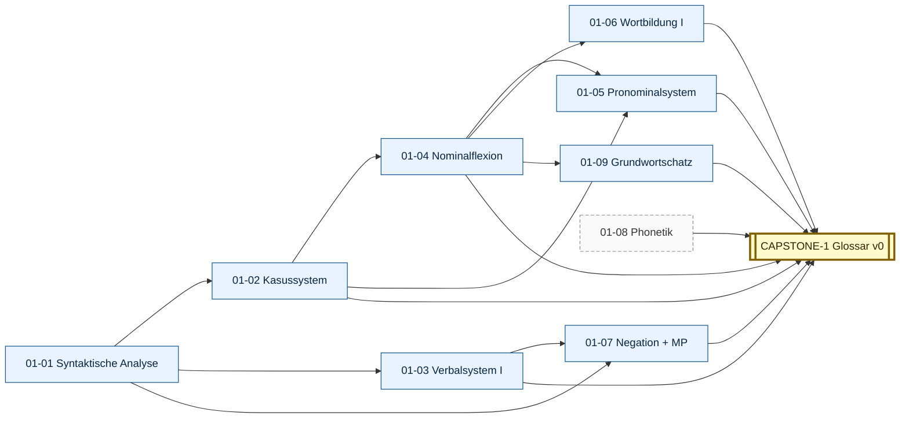

# Stage 1 — FUNDAMENTE

> **Saída esperada:** você decompõe sintaticamente qualquer Aussagesatz alemão, justifica cada Kasus / Genus / Numerus / Konjugation, e produz frases simples sem erro estrutural. Você não chuta.

---

## Posição do estágio

Este é o estágio **menos negociável** do framework. Sem ele, todos os outros operam sobre uma base que você não enxerga.

A intuição PT é seu principal inimigo aqui. Em PT a ordem SVO é rígida e a flexão verbal é o âncora; em DE a ordem é V2 (com tudo topicalizável) e o âncora estrutural é o **Kasus** + a **Verbalklammer**. São arquiteturas distintas. Você precisa **aprender a sentir** a arquitetura alemã, não traduzir mentalmente.

---

## Módulos

| ID | Título | Prereqs | Texto-âncora |
|----|--------|---------|--------------|
| [01-01](01-01-syntaktische-analyse.md) | Syntaktische Analyse — Topologisches Feldermodell | — | Kant, *Was ist Aufklärung?* (1784) |
| [01-02](01-02-kasussystem.md) | Kasussystem — Funktionen und Träger | 01-01 | Kafka, *Vor dem Gesetz* (1915) |
| [01-03](01-03-verbalsystem.md) | Verbalsystem I — Tempus, Konjugation, Trennbarkeit | 01-01 | Brüder Grimm, *Der goldene Schlüssel* (1857) |
| [01-04](01-04-nominalflexion.md) | Nominalflexion — Genus, Numerus, Adjektivdeklination | 01-02 | Kleist, *Anekdote aus dem letzten preußischen Kriege* (1810) |
| [01-05](01-05-pronominalsystem.md) | Pronominalsystem | 01-02, 01-04 | Tucholsky, *Berlin! Berlin!* (1919) |
| [01-06](01-06-wortbildung.md) | Wortbildung I — Komposition, Derivation, Konversion | 01-04 | Heidegger, *Brief über den Humanismus* (1947) |
| [01-07](01-07-negation-modalpartikeln.md) | Negation und Modalpartikeln Grundlagen | 01-01, 01-03 | Brecht, *Mutter Courage und ihre Kinder* (1939) |
| [01-08](01-08-phonetik.md) | Phonetik & Phonologie | — (paralelo) | Tagesschau + Goethe, *Erlkönig* (1782) |
| [01-09](01-09-grundwortschatz.md) | Grundwortschatz (~2000 Lemmata) | 01-04 | DWDS-Kernkorpus 18-21 |
| [**CAPSTONE-1**](CAPSTONE-fundamente.md) | **Erkenntnisprojekt v0** — Glossar fonético-estrutural do *Begriff* | todos os 9 | (texto canônico do *Begriff*) |

---

## DAG do Stage 1

### Textual (ASCII)

```
01-01 (Syntaktische Analyse) ──┬─► 01-02 (Kasus) ──┬─► 01-04 (Nominalflexion) ──► 01-05 (Pronomen)
                               │                   │            │
                               │                   │            ├─► 01-06 (Wortbildung)
                               │                   │            │
                               │                   │            └─► 01-09 (Grundwortschatz)
                               │                   │
                               └─► 01-03 (Verbalsystem) ──► 01-07 (Negation + MP)

01-08 (Phonetik) ── em paralelo a tudo, do dia 1
                                                                    │
                                                                    ▼
                                                            CAPSTONE-1
                                                       (Erkenntnisprojekt v0)
```

### Visuell (Mermaid)



(Caixa pontilhada = paralelo. Mapa cross-Stage completo: [DAG.md](../00-meta/DAG.md).)

---

## Saída concreta ao fim do estágio

- 9 Tore-Trio (3 Tore × 9 módulos = 27 portões passados).
- Glossar v0 do *Begriff* escolhido, com 30 entries lexicográficas + transcrição IPA + Beleg + análise topológica + Kollokationen + Stilstufe.
- Anki deck próprio com ≥ 800 frasal cards do Grundwortschatz + erros próprios + Begriff-Wortschatz.
- Fehlerprotokoll iniciado e mantido.
- Pronúncia limpa em Auslautverhärtung, Knacklaut, Schwa-Reduktion, /r/-Distribution; capacidade de declamar Goethe *Erlkönig* com prosódia padrão.

---

## Quanto tempo?

250–500 horas, sustentadas. Não conte em meses — conte em **horas reais** dedicadas com Active Recall + Output (não em "horas com YouTube alemão de fundo").

Estimativa por módulo (faixa típica):

| Módulo | Horas |
|---|---|
| 01-01 Syntaktische Analyse | 25-50 |
| 01-02 Kasussystem | 30-60 |
| 01-03 Verbalsystem I | 30-60 |
| 01-04 Nominalflexion | 25-50 |
| 01-05 Pronominalsystem | 20-40 |
| 01-06 Wortbildung I | 20-40 |
| 01-07 Negation + Modalpartikeln | 15-30 |
| 01-08 Phonetik (paralelo) | 30-60 (distribuído) |
| 01-09 Grundwortschatz | 50-100 (Anki sustentado) |
| CAPSTONE-1 | 25-50 |
| **Total** | **270-540** |

Variação grande depende de fundo prévio em DE, contato com falantes nativos, e sustentabilidade da cadência.

---

## Como progredir

1. **Self-Assessment** primeiro (`framework/00-meta/SELF-ASSESSMENT.md`) — calibração inicial.
2. **STUDY-PROTOCOL.md** + **MENTOR.md** lidos.
3. **01-01** + **01-08** começam **em paralelo** (Syntax + Phonetik desde dia 1).
4. **01-02** quando 01-01 está sólido (mínimo Konzeptuelles Tor passado).
5. **01-03** quando 01-01 está sólido (paralelo a 01-02).
6. **01-04** quando 01-02 está sólido.
7. **01-05** quando 01-04 está sólido.
8. **01-06** quando 01-04 está sólido (paralelo a 01-05).
9. **01-07** quando 01-01 + 01-03 estão sólidos.
10. **01-09** em paralelo a tudo a partir de 01-04 (Anki acumulativo).
11. **CAPSTONE-1** quando os 9 módulos estão DONE.

Cadência sustentável: 1 módulo terminado a cada **3-6 semanas**. Stage 1 inteiro em **9-15 meses** com 10-15h/semana.
