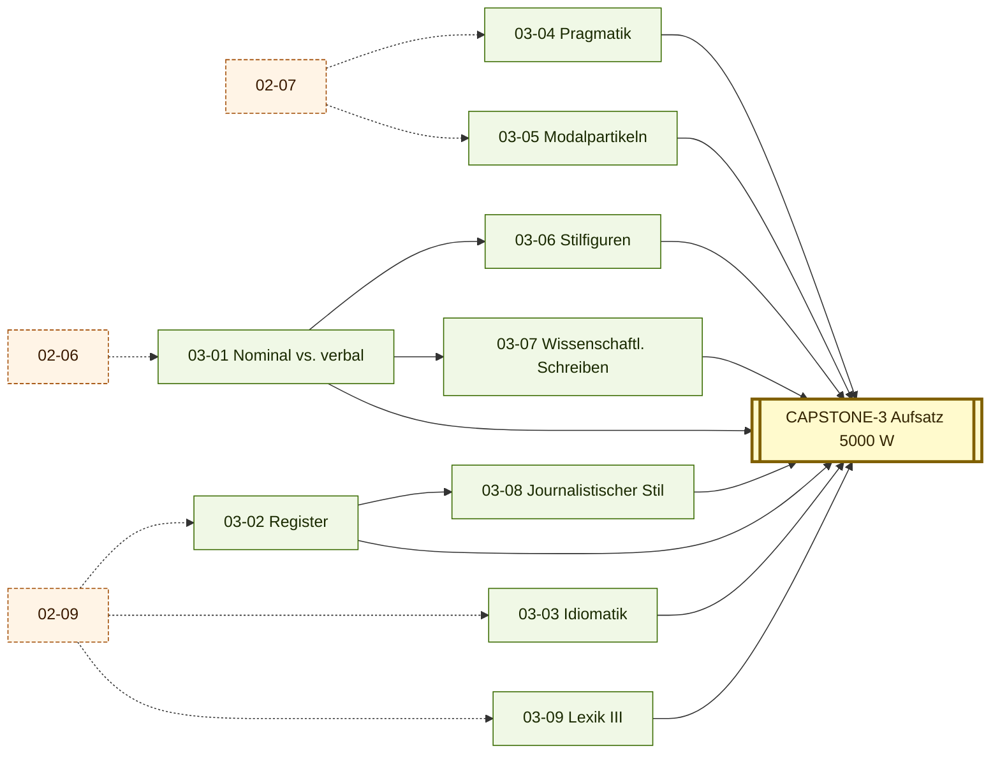

# Stage 3 — STIL (Estilística e Pragmatik)

> **Saída esperada:** você diferencia Hochsprache, Fachsprache, Feuilleton-Stil, Bürokratendeutsch; manipula Modalpartikeln com nuance; escreve Aufsatz acadêmico defensável (5000 W) com Primärquellen; lê Adorno, Habermas, Heidegger curtos com fluência analítica.

---

## Posição do estágio

Stages 1-2 deram a você o **sistema operacional** (Topologie, Kasus, Verbalsystem, Nominalflexion, Pronomen, Wortbildung, Negation, Phonetik) + a **sintaxe complexa** (Subordination, Konjunktiv I/II, Passivkonstruktionen, Inf-Sätze, FVG, Modalverben, Topik-Fokus, Lexik II). Stage 3 ativa a **estilística-pragmatik**: você passa de "produzir frases corretas com sintaxe complexa" para "**escolher o registro certo** e **manipular nuance pragmática** — Modalpartikeln, Stilfiguren, Phraseologismen, Höflichkeitsfloskeln".

Aqui você emerge como **falante adulto educado**: leitor de FAZ-Feuilleton, ouvinte do Bundestag, escritor de Aufsatz acadêmico em registro Wissenschaftsdeutsch hoch.

---

## Módulos

| ID | Título | Prereqs | Texto-âncora |
|----|--------|---------|--------------|
| [03-01](03-01-nominal-vs-verbal.md) | Nominaler vs. verbaler Stil | 02-06 | Adorno, *Negative Dialektik*, Einleitung |
| [03-02](03-02-register.md) | Register — Hochsprache, Umgangssprache, Fachsprache, Jugendsprache, Plurizentrik | 02-09 | Coletânea: Adorno + Bildzeitung + Bedienungsanleitung + Tweet + Protokoll |
| [03-03](03-03-idiomatik.md) | Idiomatik und Phraseologie — Kollokationen, Redewendungen | 02-09 | Karl Kraus, *Die letzten Tage der Menschheit*, Akt 1 |
| [03-04](03-04-pragmatik.md) | Pragmatik — Sprechakte, Implikatur, Höflichkeit | 02-07 | Bundestag Plenarprotokoll, Aktuelle Stunde |
| [03-05](03-05-modalpartikeln.md) | Modalpartikeln (sistematische Vertiefung) | 02-07 | Bernhard, *Auslöschung* |
| [03-06](03-06-stilfiguren.md) | Stilfiguren und Rhetorik | 03-01 | Heidegger, *Der Ursprung des Kunstwerks* |
| [03-07](03-07-wissenschaftliches-schreiben.md) | Wissenschaftliches Schreiben — der akademische Stil | 03-01 | Luhmann, *Soziale Systeme*, capítulo 1 |
| [03-08](03-08-journalistischer-stil.md) | Journalistischer Stil — Feuilleton, Leitartikel, Glosse, Kommentar | 03-02 | Coletânea: FAZ-Feuilleton + SZ-Leitartikel + TAZ-Glosse + NZZ-Kommentar |
| [03-09](03-09-lexik-3.md) | Lexik III — geisteswissenschaftlicher Wortschatz | 02-09 | Kant, *Kritik der reinen Vernunft*, Vorrede 2.A. |
| [03-10](03-10-hoerverstehen.md) | Hörverstehen colloquial — Filme, Serien, authentische Konversation | 01-08, 01-10, 03-02, 03-04 | Tatort + Babylon Berlin + Dark + ANHANG L (Dialekte) |
| [**CAPSTONE-3**](CAPSTONE-stil.md) | **Erkenntnisprojekt v2** — wissenschaftlicher Aufsatz (5000 Wörter) com Primärquellen | todos os 10 | Aufsatz acadêmico sobre o *Begriff* |

---

## DAG do Stage 3

### Textual (ASCII)

```
02-06 ─► 03-01 (Nominal vs. verbal) ──┬─► 03-06 (Stilfiguren)
                                      │
                                      ├─► 03-07 (Wissenschaftliches Schreiben)
                                      │
                                      ▼
02-09 ─► 03-02 (Register) ────────────┴─► 03-08 (Journalistischer Stil)

02-07 ─► 03-04 (Pragmatik) ─► 03-05 (Modalpartikeln deep)

02-09 ─► 03-03 (Idiomatik)
02-09 ─► 03-09 (Lexik III — geisteswiss.)

01-08 + 01-10 + 03-02 + 03-04 ─► 03-10 (Hörverstehen colloquial)

Tudo ──────────────────────────────────► CAPSTONE-3
                                         (Aufsatz 5000 W)
```

### Visuell (Mermaid)



(Setas tracejadas = pré-requisito cross-Stage. Mapa completo: [DAG.md](../00-meta/DAG.md).)

---

## Saída concreta ao fim do estágio

- 9 Tore-Trio (3 × 9 = 27 portões).
- **Wissenschaftlicher Aufsatz 5000 W** sobre o *Begriff* com 10-15 Primärquellen + Literaturverzeichnis acadêmico.
- Anki deck saturado para ~7000 frasal cards (Stage 1+2+3 acumulado).
- Capacidade de:
  - Ler Adorno *Negative Dialektik*, Heidegger *Sein und Zeit* (capítulos curtos), Habermas *Theorie* (curto), Luhmann (introdutório) com 90%+ compreensão.
  - Escrever Aufsatz acadêmico em registro Wissenschaftsdeutsch hoch defensável.
  - Diagnosticar Stilbruch entre 5+ registros.
  - Manipular 14+ Modalpartikeln com nuance pragmática.
  - Identificar Stilfiguren em prosa filosófica e literária.
  - Escrever uma Glosse ou um Kommentar em registro jornalístico apropriado.

---

## Quanto tempo?

400-900 horas, sustentadas. Cadência típica: 1 módulo / 4-8 semanas; Stage 3 inteiro em **12-24 meses** com 10-15h/semana.

---

## Como progredir

1. **03-01 Nominal vs. verbal Stil** primeiro — fundamento para 03-06, 03-07, 03-08.
2. **03-02 Register** em paralelo — fundamento para 03-08.
3. **03-04 Pragmatik** quando 02-07 está sólido — fundamento para 03-05.
4. **03-05 Modalpartikeln** após 03-04.
5. **03-03 Idiomatik** e **03-09 Lexik III** em paralelo (ambos dependem de 02-09).
6. **03-06, 03-07, 03-08** após 03-01 sólido (paralelo).
7. **CAPSTONE-3** quando os 9 estão DONE.
