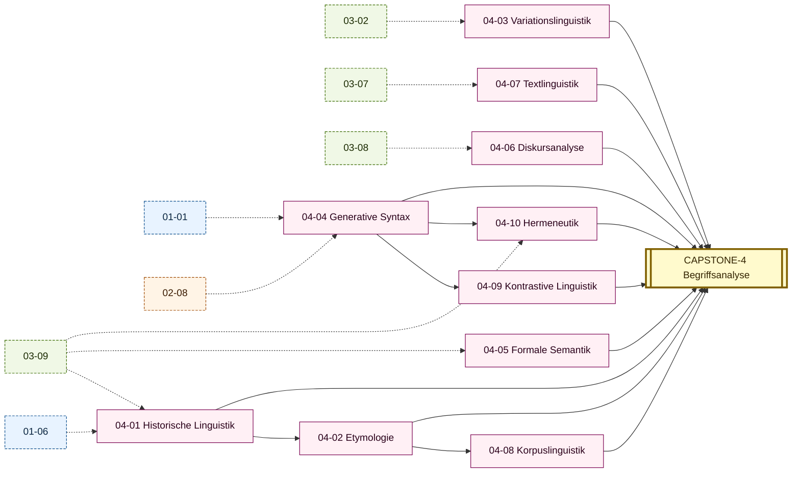

# Stage 4 — SYSTEM (Linguística e Hermenêutica)

> **Saída esperada:** você decompõe um texto de Heidegger ou Habermas em árvore sintática + análise lexicológica + crítica de registro, com evidência empírica de DWDS / COSMAS II. Lê Mittelhochdeutsch (Walther) com glossário; reconstrói etymologia diacrônica de qualquer Begriff via Pfeifer; aplica generative Syntax ao DE; produz korpusbasierte Begriffsanalyse.

---

## Posição do estágio

Stages 1-3 deram a você o **sistema operacional + sintaxe complexa + estilística**. Stage 4 ativa **a metalinguagem científica do alemão**: linguística histórica, etymologia, variação, sintaxe gerativa, semântica formal, análise de discurso, textlinguística, corpus, contrastiva PT-DE, e hermenêutica de textos canônicos.

Aqui você passa de **falante avançado adulto** para **linguista/germanista junior**: capaz de analisar empiricamente o alemão como sistema, e de ler hermeneuticamente os textos clássicos com aparelho filológico.

---

## Módulos

| ID | Título | Prereqs | Texto-âncora |
|----|--------|---------|--------------|
| [04-01](04-01-historische-linguistik.md) | Historische Linguistik — Idg., Ahd., Mhd., Frnhd., Nhd. | 01-06, 03-09 | Walther von der Vogelweide, *Under der linden* (Mhd.); Luther, *Sendbrief vom Dolmetschen* (Frnhd.) |
| [04-02](04-02-etymologie.md) | Etymologie und Wortgeschichte | 04-01 | Pfeifer, *Etymologisches Wörterbuch des Deutschen*, 30 entries do *Begriff* |
| [04-03](04-03-variationslinguistik.md) | Variationslinguistik — Dialekte, Soziolekte, Plurizentrik DE/AT/CH | 03-02 | Coletânea regional (Bayrisch, Wienerisch, Schwyzerdütsch, Plattdeutsch) |
| [04-04](04-04-generative-syntax.md) | Generative Syntax — X-bar, GB, Minimalismus auf Deutsch | 01-01, 02-08 | Sternefeld, *Syntax: Eine morphologisch motivierte generative Beschreibung des Deutschen*, capítulo 3 |
| [04-05](04-05-formale-semantik.md) | Formale Semantik — Wahrheitsbedingungen, Quantorenlogik | 03-09 | Frege, *Über Sinn und Bedeutung* (1892) |
| [04-06](04-06-diskursanalyse.md) | Diskursanalyse — Foucault, kritische Diskursanalyse, Dispositiv | 03-08 | Foucault, *Die Ordnung des Diskurses* (1970) + corpus Bundestagsdebatten |
| [04-07](04-07-textlinguistik.md) | Textlinguistik — Kohäsion, Kohärenz, Textsorten | 03-07 | Sebald, *Die Ringe des Saturn*, capítulo 1 |
| [04-08](04-08-korpuslinguistik.md) | Korpuslinguistik — DWDS, COSMAS II, kollokationsbasierte Analyse | 04-02 | DWDS Wortprofil de 5 Lemmata do *Begriff* |
| [04-09](04-09-kontrastive-linguistik.md) | Kontrastive Linguistik PT–DE | 04-04 | Coletânea PT-DE paralelas (Machado de Assis traduzido + Mann traduzido pra PT) |
| [04-10](04-10-hermeneutik.md) | Hermeneutik klassischer Texte — Kant, Hegel, Heidegger | 03-09, 04-04 | Heidegger, *Vom Wesen der Wahrheit*; Hegel, *Phänomenologie des Geistes*, Vorrede |
| [**CAPSTONE-4**](CAPSTONE-system.md) | **Erkenntnisprojekt v3** — korpusbasierte Begriffsanalyse | todos os 10 | Análise diacrônica DWDS/COSMAS do *Begriff* |

---

## DAG do Stage 4

### Textual (ASCII)

```
01-06 ─┐
03-09 ─┴─► 04-01 (Hist. Ling.) ──► 04-02 (Etymologie) ──► 04-08 (Korpus)

03-02 ─► 04-03 (Variation)

01-01 ─┐
02-08 ─┴─► 04-04 (Gen. Syntax) ──► 04-09 (Kontrastiv PT-DE)
                                        │
03-09 ─► 04-05 (Form. Semantik)         │
                                        │
03-08 ─► 04-06 (Diskursanalyse)         │
                                        │
03-07 ─► 04-07 (Textlinguistik)         │
                                        ▼
03-09 ─┐                              04-10 (Hermeneutik klass. Texte)
04-04 ─┴─► 04-10                        │
                                        ▼
Tudo ───────────────────────────► CAPSTONE-4
                                  (Korpusbasierte Begriffsanalyse)
```

### Visuell (Mermaid)



(Setas tracejadas = pré-requisito cross-Stage. Mapa completo: [DAG.md](../00-meta/DAG.md).)

---

## Saída concreta ao fim do estágio

- 10 Tore-Trio (3 × 10 = 30 portões).
- **Korpusbasierte Begriffsanalyse** (~30 páginas) do *Begriff* via DWDS/COSMAS II, com 30+ Belege diacrônicos + Kollokationsprofil + análise de Bedeutungsverschiebung (Begriffsverschiebung, à la Koselleck).
- Anki deck saturado para ~9000-10000 frasal cards (Stage 1+2+3+4 acumulado).
- Capacidade de:
  - Ler Walther von der Vogelweide (Mhd.) com glossário.
  - Reconstruir etymologia de qualquer Begriff via Pfeifer / Kluge.
  - Aplicar X-bar Theory ao DE; análise gerativa de V2.
  - Manipular DWDS / COSMAS II para análise empírica.
  - Diagnosticar Plurizentrik DE/AT/CH em texto não-marcado.
  - Decompor Heidegger *Sein und Zeit* (capítulos curtos) em árvore sintática + Wortbildung + Hermeneutik.
  - Aplicar kontrastive Linguistik PT-DE em tradução literária ou filosófica.

---

## Quanto tempo?

500-1200 horas, sustentadas. Cadência típica: 1 módulo / 5-10 semanas; Stage 4 inteiro em **18-30 meses** com 10-15h/semana.

---

## Como progredir

1. **04-01 Historische Linguistik** primeiro — fundamento para 04-02.
2. **04-02 Etymologie** após 04-01.
3. **04-03 Variation** em paralelo (depende só de 03-02).
4. **04-04 Generative Syntax** em paralelo (depende de 01-01, 02-08).
5. **04-05 Formale Semantik** em paralelo (depende de 03-09).
6. **04-06 Diskursanalyse** após 03-08.
7. **04-07 Textlinguistik** após 03-07.
8. **04-08 Korpuslinguistik** após 04-02 (precisa de etymologia operacional).
9. **04-09 Kontrastive Linguistik** após 04-04.
10. **04-10 Hermeneutik** após 03-09 e 04-04 (integração).
11. **CAPSTONE-4** quando os 10 estão DONE.
