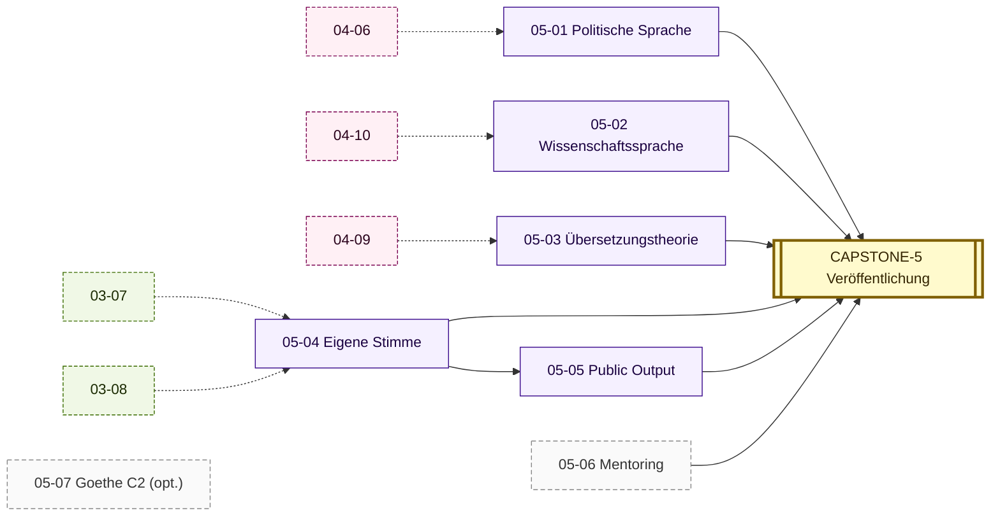

# Stage 5 — MEISTERSCHAFT (Output Público + Mentoring)

> **Saída esperada:** você publica em alemão em revista cultural ou acadêmica DE/AT/CH; traduz PT↔DE com fidelidade defensável; dá Vortrag (30 min) em Hochdeutsch erudito; mentoreia 3+ Lernende. Sua **Stimme** está formada e identificável.

---

## Posição do estágio

Stages 1-4 deram a você: sistema operacional + sintaxe complexa + estilística + linguística metateórica + hermenêutica. Stage 5 ativa **a fase de output**: você passa de **leitor erudito** para **autor publicável + mentor**.

Aqui não se aprende mais sintaxe ou léxico. Aqui se **constrói voz autoral identificável**, **publica-se em registros máximos** (Wissenschaftsdeutsch hoch, Feuilleton, oratório acadêmico), **traduz-se entre sistemas distintos**, **mentoreia-se** com aparelho rigoroso.

---

## Módulos

| ID | Título | Prereqs | Texto-âncora |
|----|--------|---------|--------------|
| [05-01](05-01-politische-sprache.md) | Politische Sprache — Bundestagsdebatten, Parteiprogramme | 04-06 | Plenarprotokoll Bundestags-Generaldebatte |
| [05-02](05-02-wissenschaftssprache.md) | Wissenschaftssprache — Habermas, Luhmann, Adorno | 04-10 | Habermas, *Theorie des kommunikativen Handelns*, capítulo 1 + Luhmann, *Soziale Systeme*, capítulo 1 |
| [05-03](05-03-uebersetzungstheorie.md) | Übersetzungstheorie und -praxis | 04-09 | Schleiermacher, *Über die verschiedenen Methoden des Übersetzens* (1813); Benjamin, *Die Aufgabe des Übersetzers* (1923) |
| [05-04](05-04-eigene-stimme.md) | Eigene Stimme — Stilbildung | 03-07, 03-08 | Coletânea: Kafka *Tagebücher*, Mann *Lebensabriss*, Bernhard *Wittgensteins Neffe* |
| [05-05](05-05-public-output.md) | Public Output — Vortrag, Artikel, Podcast | 05-04 | Adorno, *Erziehung nach Auschwitz* (1966, Vortrag); Habermas, *Glauben und Wissen* (Friedenspreisrede 2001) |
| [05-06](05-06-mentoring.md) | Mentoring von Lernenden | todos os módulos | (sem texto-âncora; o aluno é o material) |
| [05-07](05-07-goethe-c2.md) | Goethe-Zertifikat C2 / TestDaF (opcional) | todos | Modellprüfung Goethe C2 / TDN5 |
| [**CAPSTONE-5**](CAPSTONE-meisterschaft.md) | **Erkenntnisprojekt v4** — Veröffentlichung in einer deutschen Publikation | todos | Artigo aceito em revista DE/AT/CH |

---

## DAG do Stage 5

### Textual (ASCII)

```
04-06 ─► 05-01 (Politische Sprache)

04-10 ─► 05-02 (Wissenschaftssprache: Habermas, Luhmann, Adorno)

04-09 ─► 05-03 (Übersetzungstheorie + Praxis)

03-07 ─┐
03-08 ─┴─► 05-04 (Eigene Stimme — Stilbildung) ──► 05-05 (Public Output)

Tudo ──► 05-06 (Mentoring)

Tudo ──► 05-07 (Goethe C2 / TestDaF, opcional)

Tudo ──► CAPSTONE-5 (Veröffentlichung)
```

### Visuell (Mermaid)



(Caixa pontilhada = paralelo / opcional. Setas tracejadas = pré-requisito cross-Stage. Mapa completo: [DAG.md](../00-meta/DAG.md).)

---

## Saída concreta ao fim do estágio

- 7 Tore-Trio (3 × 7 = 21 portões; 05-07 opcional pode ser pulado).
- **Veröffentlichung em revista DE/AT/CH** (cultural ou acadêmica) — artigo publicado no mundo real.
- **Vortrag de 30 min gravado** em Hochdeutsch erudito (filmado ou áudio).
- **1 episódio de podcast** em DE sobre o *Begriff*.
- **1 tradução PT↔DE publicada** (literária, filosófica, ou jornalística).
- **3+ Lernende mentorados** com aparelho RUBRIC.md aplicado.
- **Anki deck saturado**: ~10000+ frasal cards, com voz autoral codificada em escolhas lexicais próprias.
- **Goethe-Zertifikat C2** ou **TestDaF-TDN5** (opcional, marcador externo).

---

## Quanto tempo?

600-1500 horas, sustentadas. Cadência típica: 1 módulo / 6-12 semanas; Stage 5 inteiro em **18-30 meses** com 10-15h/semana.

---

## Como progredir

1. **05-04 Eigene Stimme** primeiro — fundamento para todo output público.
2. **05-01 Politische Sprache, 05-02 Wissenschaftssprache, 05-03 Übersetzungstheorie** em paralelo (depende de prereqs distintos do Stage 4).
3. **05-05 Public Output** após 05-04 sólido.
4. **05-06 Mentoring** após 05-04 + 05-05 (mentor precisa ter Stimme + experiência de output).
5. **05-07 Goethe C2 / TestDaF** opcional, calendário externo.
6. **CAPSTONE-5** quando a maioria dos módulos estão DONE.

---

## Posição final no FATHOM-Deutsch

CAPSTONE-5 = **fim do framework principal**. Após ele:

- O aprendiz está em **C2+ World Class**.
- Pode contribuir para germanística junior.
- Pode mentorear próximos aprendizes (multi-geracional).
- O Erkenntnisprojekt está **publicado**.

**Manutenção contínua**: Spaced re-test, leitura sustentada, output regular, novas Begriffe, expansão.
